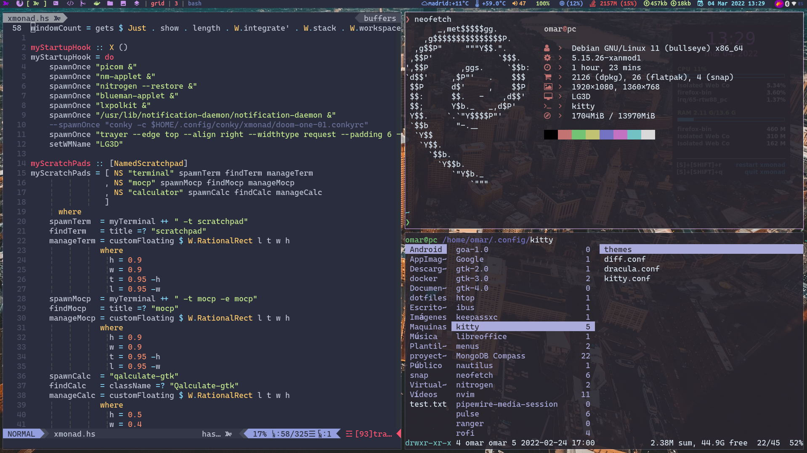

# Dotfiles and Configs 🐧

                              

My dotfiles repo, here you can find all my window manager configs as well as documentation and a guide on how to make your own desktop environment. 
# Overview 🤖

This guide will walk you through the process of building a desktop environment starting with a fresh Fedora based installation. I will assume that you are comfortable with Linux based operating systems and command line interfaces. Because you are reading this, I will also assume that you've looked through some "tiling window manager" videos on Youtube, because that's where the rabbit hole starts. You can pick any window managers you want, but I'm going to use Gnome to setup for the basic install. This is basically a description of how I made my desktop environment from scratch.

# Debian Installation 😜
Before of the installation of debian you must set your repos
```
sudo vim /etc/apt/sources.list
```
Copy all and paste on the sources.list
```
deb http://deb.debian.org/debian/ bullseye main non-free contrib
deb-src http://deb.debian.org/debian/ bullseye main non-free contrib
 
deb http://security.debian.org/debian-security bullseye-security main contrib non-free
deb-src http://security.debian.org/debian-security bullseye-security main contrib non-free
 
# bullseye-updates, to get updates before a point release is made;
# see https://www.debian.org/doc/manuals/debian-reference/ch02.en.html#_updates_and_backports
deb http://deb.debian.org/debian/ bullseye-updates main contrib non-free
deb-src http://deb.debian.org/debian/ bullseye-updates main contrib non-free
```
Now you update your system
```
sudo apt update -y  && sudo upgrade upgrade -y

```
# Installing XanMod Kernel 🦅

```
echo 'deb http://deb.xanmod.org releases main' | sudo tee /etc/apt/sources.list.d/xanmod-kernel.list
wget -qO - https://dl.xanmod.org/gpg.key | sudo apt-key --keyring /etc/apt/trusted.gpg.d/xanmod-kernel.gpg add -
sudo apt update && sudo apt install linux-xanmod
```
## Installing software that I use
```
sudo apt install neovim git tmux kitty nodejs npm curl -y
sudo apt install ufw -y
sudo apt install figlet  exa neofetch htop ranger  rofi -y
sudo apt install  nitrogen -y
sudo apt install alacarte -y
```
Turn on some services ⚡

```
sudo systemctl enable ufw --now

```
# Shell and terminals 💻
- Download  [NerdFonts](https://www.nerdfonts.com/font-downloads) 
- I use  [CascadiaCode](https://github.com/ryanoasis/nerd-fonts/releases/download/v2.1.0/CascadiaCode.zip)   

Dowload it and run the following comands
```
unzip name_file
sudo mv *.ttf /usr/share/fonts/
```
## Kitty 🐱
[See here my config and Keybindings 🐱](https://github.com/dlowTux/dotfiles/tree/main/.config/kitty)
Use my configs for kitty 
```
 cd ~/.config 
git clone https://github.com/dlowTux/kitty.git
```

## Change the default shell 👻
```
chsh -s $(which zsh)
```
## Ohmyzsh
```
sh -c "$(curl -fsSL https://raw.githubusercontent.com/ohmyzsh/ohmyzsh/master/tools/install.sh)"
```
## Shell prompt
```
sh -c "$(curl -fsSL https://starship.rs/install.sh)"
```
## Installing shell-color-scripts
```
git clone https://gitlab.com/dwt1/shell-color-scripts.git
cd shell-color-scripts
rm -rf /opt/shell-color-scripts || return 1
sudo mkdir -p /opt/shell-color-scripts/colorscripts || return 1
sudo cp -rf colorscripts/* /opt/shell-color-scripts/colorscripts
sudo cp colorscript.sh /usr/bin/colorscript
sudo cp zsh_completion/_colorscript /usr/share/zsh/site-functions

```
## Wallpapers 🐻
```
git clone https://github.com/antoniosarosi/Wallpapers.git
git clone https://github.com/dlowTux/wallpapers.git
git clone https://gitlab.com/dwt1/wallpapers.git
```

## Neovim 👽
[See here my config and Keybindings](https://github.com/dlowTux/dotfiles/tree/main/.config/nvim)
Use my configs for Neovim 
```
sudo npm install yarn -g
sh -c 'curl -fLo "${XDG_DATA_HOME:-$HOME/.local/share}"/nvim/site/autoload/plug.vim --create-dirs \
       https://raw.githubusercontent.com/junegunn/vim-plug/master/plug.vim'
 

```

